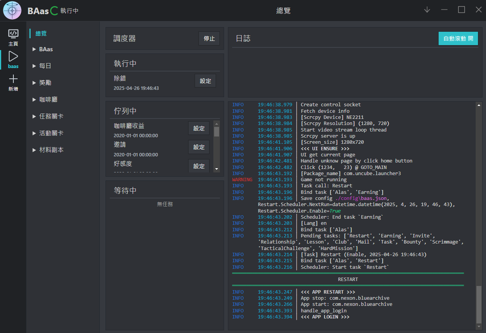
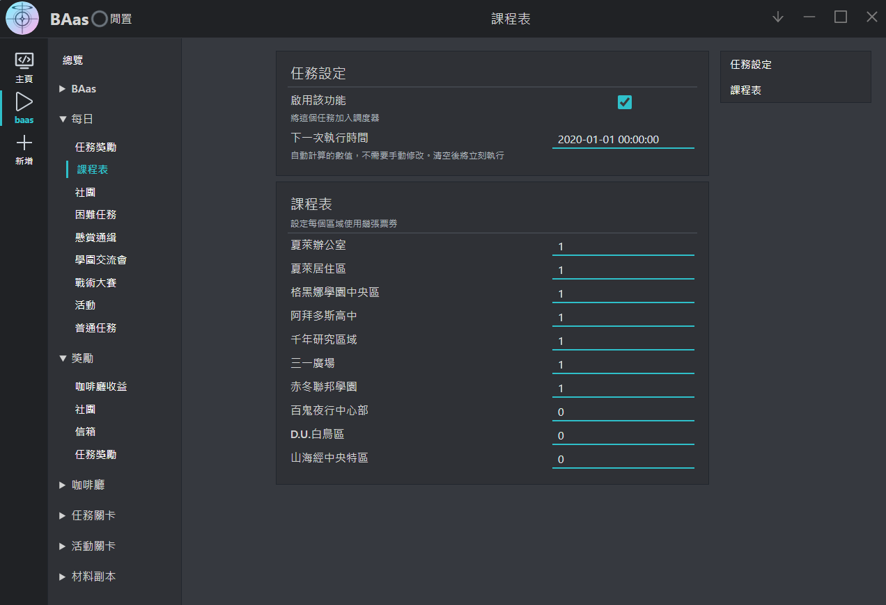

**| 繁體中文 | [English](README_en.md)**

# Blue Archive auto script

Blue Archive auto script | 蔚藍檔案自動化腳本，基于下一代Alas框架。

在經過了約一年的遊玩後，深深的見識到了長草期對遊戲熱情的消耗力。\
在網路上找了一圈後，BA 的腳本都有點小毛病，所以索性自己動手，豐衣足食。

\\\\\\ 感謝大佬 [LmeSzinc](https://github.com/LmeSzinc) 造出了又大又圓的輪子 ///\
本專案 Fork 自大佬 [LmeSzinc](https://github.com/LmeSzinc) 的 [StarRailCopilot](https://github.com/LmeSzinc/StarRailCopilot)，加上了對 Blue Archive 的支援，使用方式基本一樣，目前完成了 BA 大部分日常的自動化功能，請各位老師把寶貴的時間用來與學生培養感情，枯燥乏味的日常工作就交給 BAas 吧！

## 預覽

## 功能

- **每日任務**: 自動完成幾乎所有每日任務
- **咖啡廳**: 自動邀約與摸頭，讓所有學生感受老師的溫暖
- **刷本**: 可設定需刷取的材料與裝備，每日自動刷本
- **活動**: 活動自動推圖，包括劇情與任務

## 安装 

請參考 [安裝方法](https://github.com/LmeSzinc/StarRailCopilot/wiki/Installation_cn)，包含自動安裝，使用方法，手動安裝。\
兩者只有文字與顏色不同，其餘皆一樣

## 目前進度
1. 目前僅支援國際服英文版本，正在加入繁體中文版的支持
2. 完善副本刷取的選項
3. 未來打算加入以學生為導向的副本刷取模式

## 註
~~因為我實在沒再玩 BA 了，所以隨時有可能棄坑~~

<!-- ## 开发

Discord https://discord.gg/aJkt3mKDEr QQ群 752620927

- [小地图识别原理](https://github.com/LmeSzinc/StarRailCopilot/wiki/MinimapTracking)
- 开发文档（目录在侧边栏）：[Alas wiki](https://github.com/LmeSzinc/AzurLaneAutoScript/wiki/1.-Start)，但很多内容是新写的，建议阅读源码和历史提交。
- 开发路线图：见置顶 issue，欢迎提交 PR，挑选你感兴趣的部分进行开发即可。

> **如何添加多语言/多服务器支持？** 需要适配 assets，参考 [开发文档 “添加一个 Button” 一节](https://github.com/LmeSzinc/AzurLaneAutoScript/wiki/4.1.-Detection-objects#%E6%B7%BB%E5%8A%A0%E4%B8%80%E4%B8%AA-button)。 -->

<!-- ## 关于 Alas

SRC 基于碧蓝航线脚本 [AzurLaneAutoScript](https://github.com/LmeSzinc/AzurLaneAutoScript) 开发，Alas 经过三年的发展现在已经达到一个高完成度，但也累积了不少屎山难以改动，我们希望在新项目上解决这些问题。

- 更新 OCR 库。Alas 在 cnocr==1.2.2 上训练了多个模型，但依赖的 [mxnet](https://github.com/apache/mxnet) 已经不怎么活跃了，机器学习发展迅速，新模型的速度和正确率都碾压旧模型。
- 配置文件 [pydantic](https://github.com/pydantic/pydantic) 化。自任务和调度器的概念加入后用户设置数量倍增，Alas 土制了一个代码生成器来完成配置文件的更新和访问，pydantic 将让这部分更加简洁。
- 更好的 Assets 管理。button_extract 帮助 Alas 轻易维护了 4000+ 模板图片，但它有严重的性能问题，对外服缺失 Assets 的提示也淹没在了大量垃圾 log 中。
- 减少对于碧蓝的耦合。Alas 框架和 Alas GUI 有对接其他游戏及其脚本的能力，但已经完成的明日方舟 [MAA](https://github.com/MaaAssistantArknights/MaaAssistantArknights) 插件和正在开发的 [fgo-py](https://github.com/hgjazhgj/FGO-py) 插件都发现了 Alas 与碧蓝航线游戏本身耦合严重的问题。 -->

