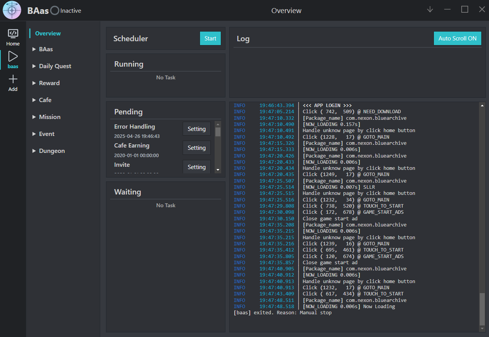
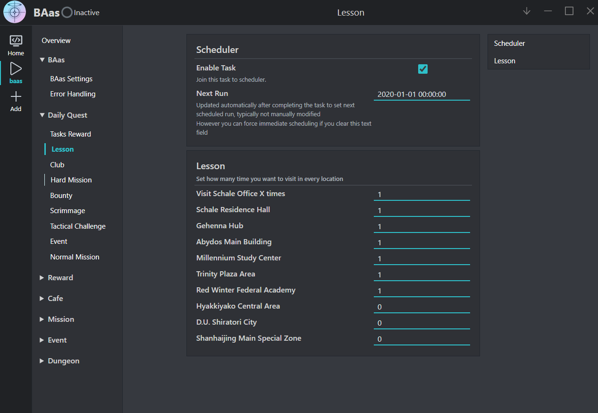

# Blue Archive Auto Script

Blue Archive Auto Script | 蔚藍檔案自動化腳本, based on the next-generation Alas framework.

After playing for about a year, I deeply experienced how the long periods of inactivity can diminish the enthusiasm for the game. After searching online for a while, I found that existing Blue Archive scripts had some minor issues, so I decided to take matters into my own hands.

\\\\\\ Many thanks to [LmeSzinc](https://github.com/LmeSzinc) for creating such a great framework! ///\
This project is forked from [LmeSzinc](https://github.com/LmeSzinc)'s [StarRailCopilot](https://github.com/LmeSzinc/StarRailCopilot), with added support for Blue Archive. The usage is basically the same. Currently, most of Blue Archive's daily automation features have been completed. Teachers, please use your precious time to bond with your students, and leave the tedious daily tasks to BAas!

## Preview

## Features

-   **Daily Missions**: Automatically completes almost all daily missions.
-   **Cafe**: Automatically invites and head-pats students, allowing all students to feel the teacher's warmth.
-   **Farming**: Can set the required materials and equipment to farm, automatically farming daily.
-   **Events**: Automatically clears event stages, including story and missions.

## Installation
Please refer to the [Installation Guide](https://github.com/LmeSzinc/StarRailCopilot/wiki/Installation_en), which includes automatic installation, usage instructions, and manual installation. The text and colors are the only differences; everything else is the same.

## Current Progress

1.  Currently, only the international English version is supported. Traditional Chinese version support is being added.
2.  Improving the options for farming stages.
3.  Future plans include adding a student-oriented stage farming mode.

## Note

~~Because I'm really not playing BA anymore, I might drop this project at any time.~~